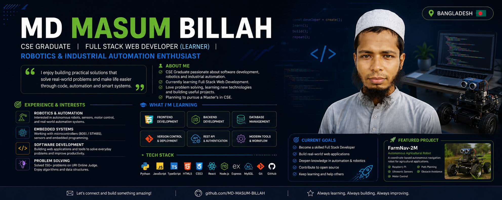

# Hi, I'm MD MASUM BILLAH 👋

### 💻 CSE Graduate | Full Stack Web Development Learner | Robotics & Automation Enthusiast

I'm a Computer Science & Engineering graduate interested in building practical software and hardware-based solutions. I enjoy programming, problem solving, embedded systems, robotics, and industrial automation.

---

## 🚀 About Me

- 🎓 CSE Graduate
- 🌱 Currently learning **Full Stack Web Development**
- 💻 Interested in **Software Development**
- 🤖 Passionate about **Robotics & Industrial Automation**
- 🔧 Interested in **Embedded Systems, Sensors & Automation**
- 🧠 Enjoy **Problem Solving & Algorithms**
- 🌾 Working on robotics and autonomous navigation projects
- 📍 Jashore, Bangladesh 🇧🇩

---

## 🛠️ Technologies & Skills

### Programming Languages

### Full Stack Web Development

### Database

### Robotics & Embedded Systems

- 🤖 Robotics
- ⚙️ Industrial Automation
- 🔌 Embedded Systems
- 📡 Sensors & Actuators
- 🎛️ Motor Control
- 🍓 Raspberry Pi
- 🔧 8051 / STM8S
- 🗺️ Autonomous Navigation

### Tools

---

<!--
## 🤖 Featured Project

### 🌾 FarmNav-2M

An autonomous agricultural robot navigation project designed for coordinate-based navigation.

**Technologies & Concepts:**

- Raspberry Pi
- Python
- Ultrasonic Sensors
- Motor Control
- Coordinate-Based Navigation
- Path Planning
- Obstacle Detection
- Autonomous Robotics

The project aims to develop practical robotic systems for agricultural applications.

---
-->
## 💡 My Interests

- 🤖 Robotics
- ⚙️ Industrial Automation
- 🔌 Embedded Systems
- 💻 Full Stack Web Development
- 🧠 Problem Solving
- 📡 Sensors & Control Systems
- 🌐 Software Development
- 🚗 Autonomous Systems

---

## 🎯 Current Goals

- 🔹 Become a skilled **Full Stack Web Developer**
- 🔹 Build real-world web applications
- 🔹 Improve my backend and frontend development skills
- 🔹 Deepen my knowledge of **Industrial Automation & Robotics**
- 🔹 Build practical embedded and automation projects
- 🔹 Continue learning and improving

## 📫 Contact Me

- 💻 GitHub: [@masum16pbh](https://github.com/masum16pbh)
- 📧 Email: [masumbillahparchakra@gmail.com](mailto:masumbillahparchakra@gmail.com)
- Facebook : [MD Masum Billah](https://www.facebook.com/md.masum.billah.49519)
- 📍 Location: **Jashore, Bangladesh 🇧🇩**

---

### ⚡ Learning today, building for tomorrow.

**Code • Create • Automate • Learn • Improve**
